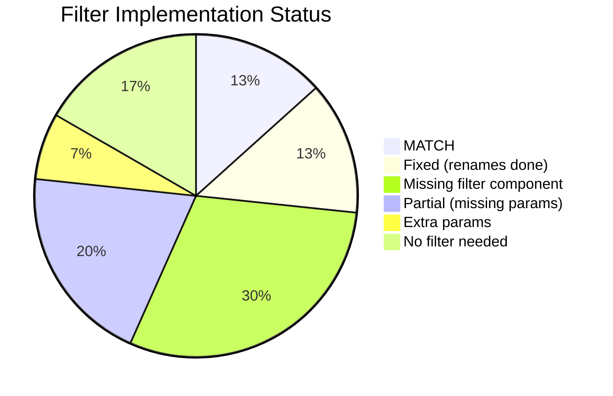

# Research: Table Filter Query Parameters

**Task ID:** table-filter-query-params
**Date:** 2026-07-09
**Status:** Complete
**Source of Truth:** `specs/api-contract.md`

---

## Executive Summary

This document catalogs every list endpoint's accepted query parameters from the API contract, cross-referenced against the current frontend filter implementation. Each of the 30 table modules is analyzed with its contract params, actual filter component behavior, and any gaps.

**Key findings:**
- 3 param name mismatches fixed in prior session (`start_at`→`start_date`, `end_at`→`end_date`, `status`→`document_status`)
- 2 extra params sent that backend ignores (`fulfillment_status`, `date`)
- 9 modules have zero filter components
- 6 contract params missing from existing filter components
- 4 modules have partial filters missing available params

---

## Endpoint Query Parameter Reference

### Legend

| Status | Meaning |
|--------|---------|
| ✅ MATCH | Param correctly named and sent |
| ❌ MISMATCH | Param name wrong |
| ⚠️ MISSING | Contract param not sent |
| 🟡 EXTRA | Param sent but not in contract |
| 🔴 NO FILTER | No filter component exists |

---

### 1. `GET /inventory/item`
**File:** `src/pages/inventory/item/table/item.filter.tsx`
**Contract:**
| Param | Type | Description |
|-------|------|-------------|
| `page` | int | Page number |
| `limit` | int | Items per page |
| `search` | string | Search name/barcode |
| `type` | string | `raw_material`, `finished_goods` |
| `category` | string | Filter by category |
| `is_active` | bool | Filter by active status |

**Sends:** `is_active` ✅
**Missing:** `type`, `category`

---

### 2. `GET /inventory/catalog`
**File:** `src/pages/inventory/catalog/table/catalog.filter.tsx`
**Contract:**
| Param | Type | Description |
|-------|------|-------------|
| `page` | int | Page number |
| `limit` | int | Items per page |
| `search` | string | Search name |
| `is_active` | bool | Filter by active status |
| `item_type` | string | Filter by item type |

**Sends:** `is_active` ✅
**Missing:** `item_type`

---

### 3. `GET /outlet`
**Contract:**
| Param | Type | Description |
|-------|------|-------------|
| `page` | int | Page number |
| `limit` | int | Items per page |
| `search` | string | Search name/phone |
| `outlet_type_id` | string | Filter by type |
| `is_active` | bool | Filter by active status |

**Status:** 🔴 NO FILTER — no filter component at `src/pages/setting/outlet/`

---

### 4. `GET /outlet/type`
**Contract:** `page`, `limit`, `search`, `is_active`
**Status:** 🔴 NO FILTER

---

### 5. `GET /pos/menu`
**File:** `src/pages/setting/pos/menu/table/menu.filter.tsx`
**Contract:**
| Param | Type | Description |
|-------|------|-------------|
| `page` | int | Page number |
| `limit` | int | Items per page |
| `search` | string | Search name |
| `category_id` | string | Filter by category |
| `is_active` | bool | Filter by active status |

**Sends:** Only `search` via `handleSearch` (not `table.filter()`)
**Missing:** `category_id`, `is_active`

---

### 6. `GET /pos/category`
**File:** `src/pages/setting/pos/category/table/category.filter.tsx`
**Contract:** `page`, `limit`, `search`, `is_active`
**Status:** 🔴 Empty placeholder — no actual filter logic

---

### 7. `GET /pos/channel`
**Contract:** `page`, `limit`, `search`, `is_active`
**Status:** 🔴 NO FILTER

---

### 8. `GET /payment/method`
**File:** `src/pages/setting/pos/payment/table/payment.filter.tsx`
**Contract:** `page`, `limit`, `search`, `is_active`
**Sends:** Only `search` via `handleSearch`
**Missing:** `is_active`

---

### 9. `GET /supplier`
**Contract:**
| Param | Type | Description |
|-------|------|-------------|
| `page` | int | Page number |
| `limit` | int | Items per page |
| `search` | string | Search name/phone |
| `is_active` | bool | Filter by active status |
| `type` | string | `distributor`, `factory`, `store` |

**Status:** 🔴 NO FILTER

---

### 10. `GET /user`
**Contract:**
| Param | Type | Description |
|-------|------|-------------|
| `page` | int | Page number |
| `limit` | int | Items per page |
| `search` | string | Search name/username |
| `usergroup_id` | string | Filter by usergroup |
| `is_active` | bool | Filter by active status |

**Status:** 🔴 NO FILTER

---

### 11. `GET /user/usergroup`
**Contract:** `page`, `limit`, `search`
**Status:** 🔴 NO FILTER (no params beyond standard, so acceptable)

---

### 12. `GET /member/topup-bonus`
**Contract:** `page`, `limit`, `search`, `is_active`
**Status:** 🔴 NO FILTER

---

### 13. `GET /sales/order`
**File:** `src/pages/sales/order/table/order.filter.tsx`
**Contract:**
| Param | Type | Description |
|-------|------|-------------|
| `page` | int | Page number |
| `limit` | int | Items per page |
| `search` | string | Search |
| `document_status` | string | `pending`, `published`, `cancelled` |
| `payment_status` | string | `unpaid`, `paid` |
| `outlet_id` | string | Filter by outlet |
| `warehouse_id` | string | Filter by warehouse |
| `start_date` | string | Filter start (YYYY-MM-DD) |
| `end_date` | string | Filter end (YYYY-MM-DD) |

**Sends:** `document_status` ✅, `payment_status` ✅, `start_date` ✅, `end_date` ✅
**Missing:** `outlet_id`, `warehouse_id`
**Extra:** `fulfillment_status` 🟡 (not in contract)

---

### 14. `GET /sales/return`
**File:** `src/pages/sales/return/table/return.filter.tsx`
**Contract:** `page`, `limit`, `search`
**Sends:** `date` 🟡 (extra — not in contract)

---

### 15. `GET /purchase/order`
**File:** `src/pages/purchase/order/table/order.filter.tsx`
**Contract:**
| Param | Type | Description |
|-------|------|-------------|
| `page` | int | Page number |
| `limit` | int | Items per page |
| `search` | string | Search |
| `document_status` | string | `pending`, `published` |
| `outlet_id` | string | Filter by outlet |
| `supplier_id` | string | Filter by supplier |
| `start_date` | string | Filter start (YYYY-MM-DD) |
| `end_date` | string | Filter end (YYYY-MM-DD) |

**Status:** 🔴 Empty placeholder — no filter UI, all params missing

---

### 16. `GET /b2b/order`
**Contract:**
| Param | Type | Description |
|-------|------|-------------|
| `page` | int | Page number |
| `limit` | int | Items per page |
| `search` | string | Search |
| `document_status` | string | `pending`, `shipped`, `received`, `invoiced` |
| `start_date` | string | Filter start (YYYY-MM-DD) |
| `end_date` | string | Filter end (YYYY-MM-DD) |

**Status:** 🔴 NO FILTER

---

### 17. `GET /production/plan`
**File:** `src/pages/production/plan/table/plan.filter.tsx`
**Contract:**
| Param | Type | Description |
|-------|------|-------------|
| `page` | int | Page number |
| `limit` | int | Items per page |
| `search` | string | Search |
| `document_status` | string | Filter |
| `outlet_id` | string | Filter by outlet |
| `start_date` | string | Filter start (YYYY-MM-DD) |
| `end_date` | string | Filter end (YYYY-MM-DD) |

**Sends:** `document_status` ✅, `start_date` ✅, `end_date` ✅
**Missing:** `outlet_id`

---

### 18. `GET /warehouse`
**Contract:** No query params listed
**Status:** ✅ No filter needed

---

### 19. `GET /withdrawal-request`
**Contract:**
| Param | Type | Description |
|-------|------|-------------|
| `page` | int | Page number |
| `limit` | int | Items per page |
| `search` | string | Search |
| `document_status` | string | `pending`, `approved`, `rejected` |
| `outlet_id` | string | Filter by outlet |

**Status:** 🔴 NO FILTER

---

### 20. `GET /outlet-topup-request`
**Contract:**
| Param | Type | Description |
|-------|------|-------------|
| `page` | int | Page number |
| `limit` | int | Items per page |
| `search` | string | Search |
| `document_status` | string | Filter |
| `outlet_id` | string | Filter by outlet |

**Status:** 🔴 NO FILTER

---

### 21. `GET /report/outstanding`
**Contract:**
| Param | Type |
|-------|------|
| `outlet_id` | string |
| `start_date` | string |
| `end_date` | string |
| `page` | int |
| `limit` | int |
| `order_by` | string |

**File:** `src/pages/report/table/pos-outstanding.filter.tsx`
**Sends:** `start_date` ✅, `end_date` ✅
**Missing:** `outlet_id`

---

### 22. `GET /report/pos-settlement`
**Contract:**
| Param | Type |
|-------|------|
| `periode` | string |
| `periode_type` | string |
| `outlet_id` | string |

**File:** `src/pages/report/table/settlement.filter.tsx`
**Sends:** `outlet_id` ✅
**Missing:** `periode`, `periode_type`

---

### 23. `GET /report/product-sales`
**Contract:** `outlet_id`, `start_date`, `end_date`, `page`, `limit`, `order_by`
**File:** `src/pages/report/table/product-sales.filter.tsx`
**Sends:** `start_date` ✅, `end_date` ✅
**Missing:** `outlet_id`

---

### 24. `GET /report/raw-material-sales`
**Contract:** "Various query options" (unspecified)
**Status:** 🔴 No specific params documented

---

### 25. `GET /report/warehouse-stock`
**Contract:**
| Param | Type |
|-------|------|
| `warehouse_id` | string |
| `item_id` | string |
| `page` | int |
| `limit` | int |
| `order_by` | string |

**Status:** 🔴 NO FILTER

---

### 26. `GET /report/b2b/settlement`
**Contract:** Not specified
**Config:** `lockedFilter: {params_type: "yearly"}`
**Status:** ✅ Static filter only

---

### 27. `GET /report/b2b/product-sales`
**Contract:** Not specified
**Status:** 🔴 No filter

---

### 28. `GET /demand/production`
**Contract:**
| Param | Type | Description |
|-------|------|-------------|
| `production_date` | string | Filter by date |
| `outlet_id` | string | Filter by outlet |

**File:** `src/pages/production/demand/table/production.filter.tsx`
**Sends:** `production_date` ✅
**Missing:** `outlet_id`

---

### 29. `GET /demand/item`
**Contract:** `production_date`, `outlet_id`
**Status:** No standalone filter (child of demand production page)

---

## Summary Tables

### By Severity



### Modules Missing Filter Components Entirely

| Endpoint | Available Params |
|----------|-----------------|
| `GET /outlet` | `outlet_type_id`, `is_active` |
| `GET /outlet/type` | `is_active` |
| `GET /pos/channel` | `is_active` |
| `GET /supplier` | `is_active`, `type` |
| `GET /user` | `usergroup_id`, `is_active` |
| `GET /withdrawal-request` | `document_status`, `outlet_id` |
| `GET /outlet-topup-request` | `document_status`, `outlet_id` |
| `GET /b2b/order` | `document_status`, `start_date`, `end_date` |
| `GET /report/warehouse-stock` | `warehouse_id`, `item_id` |

### Modules Missing Contract Params in Existing Filters

| Endpoint | Missing Params |
|----------|---------------|
| `GET /sales/order` | `outlet_id`, `warehouse_id` |
| `GET /production/plan` | `outlet_id` |
| `GET /purchase/order` | All (empty placeholder) |
| `GET /report/outstanding` | `outlet_id` |
| `GET /report/product-sales` | `outlet_id` |
| `GET /report/pos-settlement` | `periode`, `periode_type` |
| `GET /inventory/item` | `type`, `category` |
| `GET /inventory/catalog` | `item_type` |
| `GET /demand/production` | `outlet_id` |

### Extra Params (Not in Contract)

| Endpoint | Extra Param | Risk |
|----------|------------|------|
| `GET /sales/order` | `fulfillment_status` | Ignored by backend |
| `GET /sales/return` | `date` | Ignored by backend |

---

## How Table Filters Work (Architecture)

```
Filter Component
  └─ calls table.filter({ key: value })
       └─ stored in Redux table state
            └─ merged with lockedFilter
                 └─ passed as query params to API:
                      GET /endpoint?page=1&limit=10&key=value
```

**Key files:**
- **API layer:** `src/services/table/api.tsx` — `buildParams()` constructs `{page, limit, search, order_by, ...lockedFilter, ...filter}`
- **Filter mechanism:** `src/services/table/hooks.tsx` — `onFilter()` merges lockedFilter + existing filter + new field
- **Config pattern:** `src/pages/*/table/*.config.tsx` — returns `{ url, columns, filter?, lockedFilter? }`

---

## Open Questions

- Should `fulfillment_status` be added to the contract or removed from FE?
- Should `date` on sales/return be formalized in the contract?
- Priority order for adding missing filter components?

---

## Next Steps

1. Review this document against actual backend behavior
2. Decide priority for adding missing filter components
3. Remove extra params or formalize them in the contract
4. Implement missing filters per priority

---

*Research completed with SDD 2.0*
